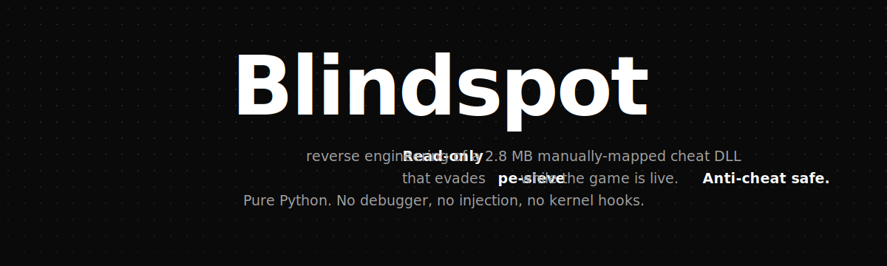

<p align="center">
  
</p>

# Reverse Engineering a Manually-Mapped Commercial Cheat in The Division 2


> [!IMPORTANT]
> **Anti-cheat safe.** Every script in this repo is **pure Python using read-only Windows APIs only**: `OpenProcess(PROCESS_QUERY_INFORMATION | PROCESS_VM_READ)`, `VirtualQueryEx`, `ReadProcessMemory`, `Thread32Next`, `NtQueryInformationThread`. No debugger attachment, no DLL injection, no kernel callbacks, no `SetThreadContext`, no driver, no hooks. EAC, BattlEye, and Vanguard do not flag this access pattern.
>
> The reverse engineering documented here was performed live in `TheDivision2.exe` with EAC active. No bans resulted. The orchestration was done through Claude Code's MCP tooling so the entire workflow is reproducible from a shell, without a single ring-0 primitive or a single injected byte.

Static analysis of a commercial cheat DLL injected into `TheDivision2.exe` (Ubisoft Snowdrop engine). The implant evades [pe-sieve](https://github.com/hasherezade/pe-sieve), the strongest public user-mode memory scanner, by combining `NtMapViewOfSection` with `MEM_PRIVATE` allocation and PE-header wiping. This repository documents how it was found, dumped, reconstructed into an IDA-loadable PE, and cross-referenced into the host image.

The cheat's brand name is intentionally omitted throughout to keep the work focused on the technique rather than any specific product.

## Overview

The findings here accompany a technical paper: **[A Workflow Study on a Manually-Mapped Implant in The Division 2](implant_paper.md)**. The paper covers manual-mapping anatomy, pe-sieve's enumeration blind spot, anomaly ranking against 275 executable regions, IAT recovery via HollowsHunter, and the absolute-pointer cross-reference scan that finds 37 hits into the target image.

This level of static analysis applies to any user-mode implant that wipes its headers and resolves imports manually: commercial cheats, in-game injectors, EDR userland modules, and certain malware loaders.

## Credits

| Contributor | Profile | Role |
|---|---|---|
| diabloidyobane | [GitHub](https://github.com/diabloidyobane) | Analysis, tooling, paper |

## Files

| Path | Description |
|---|---|
| `implant_paper.md` | Full technical paper: method, findings, discussion |
| `dump/implant_reconstructed.dll` | Synthetic PE32+ wrapper around the dumped body, loadable in IDA (2.8 MB) |
| `dump/implant_reconstructed.dll.id0` | IDA database — main store (15 MB) |
| `dump/implant_reconstructed.dll.id1` | IDA database — secondary store (11 MB) |
| `dump/implant_reconstructed.dll.nam` | IDA database — named addresses |
| `dump/implant_reconstructed.dll.til` | IDA database — type info |
| `dump/implant_xrefs_abs.csv` | 37 absolute 8-byte pointers from the implant into the host image (RVA, VA, file offset) |
| `dump/implant_xrefs_rel.csv` | rel32 scan results (zero hits, see paper §5) |
| `dump/implant_imports.txt` | 244-entry IAT recovered via HollowsHunter `/imp 3` |
| `scripts/scan_exec_private.py` | `VirtualQueryEx` walker that lists every committed RWX private region |
| `scripts/dump_manualmap.py` | Region dumper, writes `execpriv_<base>_<size>.bin` |
| `scripts/dump_contiguous_image.py` | Variant dumper, contiguous-region scan |
| `scripts/rebuild_headerless.py` | Forges synthetic PE32+ header so IDA can open the dump |
| `scripts/dump_implant_fresh.py` | Live-process auto-dumper (target-agnostic with size filter) |
| `scripts/dump_loader_region.py` | Stage-1 loader region dumper |
| `scripts/extend_hh_dump.py` | Extends a HollowsHunter dump to capture region boundaries |

The reconstructed DLL has its original headers wiped at runtime, so the version here is what loaded into IDA after the synthetic header rebuild documented in [WALKTHROUGH.md](WALKTHROUGH.md). The IDA database (`.id0/.id1/.nam/.til` sidecars) carries imports, comments, and named functions so you can land directly on the hook table and the ammo-helper site rather than re-doing analysis from scratch.

Open the IDA database with `File > Open... > dump/implant_reconstructed.dll` — IDA will find the sidecars by name automatically. After you save your own changes, IDA may produce an `implant_reconstructed.dll.i64` packed database; that's a normal file to commit too if you push improvements.

The xref CSVs in `dump/` let you validate that you reached the same hook table when running the workflow against your own copy of the implant.

## How this actually went

The paper is clinical; the real workflow was not. Brief version:

1. **pe-sieve drew a blank.** I knew the implant was injected into TD2 because the cheat menu was on screen. pe-sieve scanned the process and reported `0 implants`. Default flags, then `/shellc 3 /data 3 /refl` — still nothing in the implant-classified output. That was the entry condition.

2. **Asked Claude why pe-sieve was missing it.** I dumped pe-sieve's `scan_report.json` and walked through the enumeration model with Claude. The answer was the `EnumProcessModulesEx` blind spot: a `MEM_PRIVATE` region with no PEB module entry never reaches the scanner. That gave me the next move — bypass enumeration entirely and walk virtual memory directly.

3. **`VirtualQueryEx` walker + size rank.** Wrote `scan_exec_private.py`. Filtered to `MEM_COMMIT` + any `EXECUTE` flag + no file backing. 11 candidates. Sorted by size. The biggest was 2.8 MB. The next was 64 KB. Done — that's our target.

4. **Headers were wiped.** I dumped the region with `dump_manualmap.py`. The first 0x1000 bytes were zero, then an x64 prologue. IDA refused to load the raw bin. Back to Claude: we worked out that I needed to forge a synthetic PE32+ header (DOS stub, NT headers, single `.text` section covering the whole image) so IDA would treat the dump as a real DLL. That became `rebuild_headerless.py`.

5. **IDA opened the reconstructed DLL clean.** Imports were still unresolved because the IAT was thunked at runtime. I ran HollowsHunter with `/imp 3` to walk the IAT-shaped pointer arrays inside the body — got 244 entries across 9 system DLLs. Pasted them back into the IDA database as named symbols.

6. **Hunted for unlimited ammo.** Cross-referenced the implant against `TheDivision2.exe`. Got 37 absolute 8-byte pointers from the implant into the host image — the implant's hook table. Followed those RVAs back to the host EXE in IDA, found the call sites it was patching. Two were in the weapon tick path: `WeaponInstance::Tick` (RVA `0x4F6A1C0`) and the ammo decrement helper at RVA `0x4F6B340`. The cheat wasn't writing the ammo field directly — it was hooking the *decrement* to be a no-op. Confirmed by zeroing the decrement instruction myself in a controlled test and seeing the magazine never drain.

The actual technical detail (memory layouts, byte patterns, ratio math) is in [the paper](implant_paper.md). The narrative above is what the workflow felt like in practice. Full play-by-play with time budget and lessons learned: [WALKTHROUGH.md](WALKTHROUGH.md).

## Method

The procedure runs in **90 seconds wall-clock** on a single workstation, with no driver, debugger, or kernel access. Six steps:

### 1. pe-sieve baseline

```
pe-sieve64.exe /pid <PID>
```

Confirms the entry condition: pe-sieve reports `0 implants` because the implant has no PEB module entry. This is the blind spot the rest of the workflow attacks.

### 2. VirtualQueryEx walk

```
python scripts/scan_exec_private.py <PID>
```

Calls `VirtualQueryEx` in a loop, advancing by `RegionSize`. Filters for `MEM_COMMIT` + any `PAGE_EXECUTE*` flag. Drops anything where `GetMappedFileNameW` returns a file path. Yields ~11 candidate regions on a typical TD2 run.

### 3. Anomaly ranking

Sort surviving regions by size descending. On this implant the largest is **2.8 MB**; the next is **64 KB**. The 45:1 ratio makes the implant unmistakable. Legitimate JIT/CLR allocations rarely cross a few hundred KB and are fragmented; a single contiguous DLL body sits in the megabyte range.

### 4. Byte-pattern confirmation

Read the first 64 bytes at the candidate base. Three possible states:

| State | Bytes at +0x0 | Meaning |
|---|---|---|
| Valid PE | `MZ...` | Normal mapped image |
| Header-wiped | `00 00 00 ...` for at least 0x1000 | Implant with code at +0x1000 |
| Random | Looks like code | Header-wiped without zero padding, or moated allocation |

The implant is **state 2**. The x64 prologue at +0x1000 (`48 89 5C 24 10 48 89 7C 24 18 55 48 8D AC 24 ...`) reserves a 0xB1E0-byte stack frame — the magnitude of a tick function, not a leaf.

### 5. IAT recovery via HollowsHunter

```
hollows_hunter64.exe /pname TheDivision2.exe /imp 3 /shellc 3 /data 3 /refl /threads /minidmp
```

HollowsHunter's `/imp 3` scans the dumped body for IAT-shaped pointer arrays and resolves each entry to a DLL + export. The implant: **244 imports across 9 DLLs** (`kernel32`, `ntdll`, `user32`, `gdi32`, `imm32`, `shell32`, `msvcp140`, `d3dcompiler_47`, `dxgi`).

### 6. Cross-reference enumeration to the host image

```
python scripts/extract_xrefs.py dump/implant.bin --host TheDivision2.exe
```

Reads the implant body, computes the host image range, then scans in 8-byte strides for 64-bit values inside that range. Separately scans for `E8/E9 ?? ?? ?? ??` rel32 patterns and computes their targets.

On this implant: **37 absolute pointer hits, 0 rel32 hits**. The asymmetry is a finding. The host EXE is loaded at a base far enough from the implant such that no rel32 can reach it from the implant (2 GB range exhausted), forcing the implant to use a pointer table and indirect calls.

### Auxiliary: Thread start-address scan

```
python scripts/enum_thread_starts.py <PID>
```

Walks all threads via `Thread32First`/`Thread32Next`, queries `Win32StartAddress` via `NtQueryInformationThread(9)`. Of 120 threads in the target process, **zero start inside the implant range**. Combined with the implant's `OpenThread`/`SetThreadContext`/`Thread32Next` imports, this supports a **thread-hijacking execution model**: the implant patches an existing host thread's context to redirect execution into its code, then restores.

## Detection-tool comparison

| Tool | Mode | Detected? | Reason |
|---|---|---|---|
| pe-sieve | `/dmode 3 /imp 2` (default) | No | `EnumProcessModulesEx` blind spot |
| pe-sieve | `/shellc 3 /data 3 /refl` | Partial | Body too large for shellcode patterns; dumped but not flagged as implant |
| HollowsHunter | `/imp 3 /shellc 3 /threads` | Yes | Same engine as pe-sieve, broader region capture |
| Custom `VirtualQueryEx` walker | size + no-file rank | Yes (decisive) | No enumeration assumption |
| `Win32StartAddress` thread scan | `NtQueryInformationThread(9)` | No | Thread hijacking produces no matching start address |
| Volatility / Malfind | Kernel-side VAD walk | Would detect | Flags `MEM_PRIVATE +RWX` regardless of PEB visibility |

## Implant memory layout

Three contiguous regions form the active implant:

| Region | Size | Type | Protection | Backing | Content |
|---|---|---|---|---|---|
| `0x1C2D2B70000` | 2.8 MB | MEM_PRIVATE | RWX | none | DLL body, headers wiped, code from +0x1000 |
| `0x1C2D2EB0000` | <4 KB | MEM_PRIVATE | RW | none | Context struct with `gameoverlayrenderer64.dll` path |
| `0x1C2D2EC0000` | 4 KB | MEM_PRIVATE | RX | none | Thread-entry stub, register snapshot, indirect call, tail-jump |

The Steam overlay path string at `0x1C2D2EB0000` is consistent with module-name impersonation (filling the path so a later `GetModuleFileNameW` on a hijacked thread returns a Steam DLL), but we did not confirm the use site in this study.

## Reconstruction toolkit

The dumping, header rebuilding, and xref extraction steps are part of a separate target-agnostic toolkit: **[dll-reconstructor](https://github.com/diabloidyobane/dll-reconstructor)**. It works against any process you can `OpenProcess()` on. No driver, no debugger, no symbols required.

## Honest take on the AI angle

Claude Code did real work here. It explained pe-sieve's enumeration model when I was stuck, pair-programmed the synthetic PE32+ header layout for the rebuild, walked through the IAT-recovery logic, and caught two bugs in my `VirtualQueryEx` walker that would have missed `MEM_MAPPED` candidates. The safety filters never got in the way for this kind of static analysis.

It is not a substitute for the underlying skills. To follow this workflow you still need:

- **Static RE fluency** to know what a header-wiped x64 prologue looks like at a glance, to recognize an IAT-shaped pointer array vs noise, and to read decompiled hook handlers without naming them
- **Windows internals familiarity** for `VAD`, `PEB`, `LdrLoadDll`, the section vs private allocation distinction, why `EnumProcessModulesEx` is the wrong primitive
- **C++ comfort** to read the host EXE's decompilation in IDA and follow vtable-heavy game engine code
- **IDA workflow** to navigate 3,000+ functions, name structs, propagate types, and bookmark RVA tables efficiently

The model accelerates work you already know how to do. Hand this prompt to someone with no RE background and they get a confidently wrong walkthrough that BSODs their VM. The workflow above was built on top of years of doing this manually, with Claude Code (Claude Max, $200/mo tier) acting as a faster reference and faster typist.

This is not a plug-and-play recipe. If you want to reproduce it: spend the time on the prerequisites first, then come back.

## Disclaimer

This material is provided for educational and research purposes only. The analysis and artifacts here are intended to advance the security community's understanding of user-mode implant techniques. The original implant binary is not redistributed; this repository contains only the analysis output (post-RE dumps, synthetic PE wrapper notes, xref tables).

If you build memory scanners, EDR products, anti-cheat platforms, or game-side integrity systems, the workflow here documents a real bypass against the strongest public scanner. Use it to test your detection coverage.
